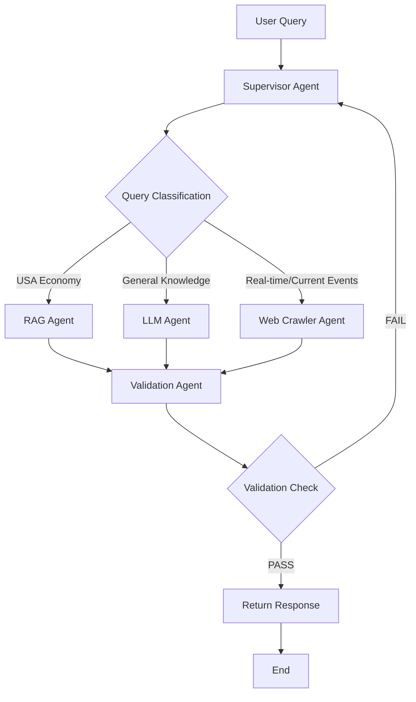

# Multi-Agent System with Supervisor Node

## Assignment Objective

This assignment demonstrates the implementation of a sophisticated **Multi-Agent System** with the following key components:

- **Supervisor Node**: Central orchestrator that classifies queries and routes them to appropriate specialized agents
- **RAG Agent**: Handles USA Economy questions using vector search and retrieval-augmented generation
- **LLM Agent**: Processes general knowledge questions using direct language model capabilities  
- **Web Crawler Agent**: Fetches real-time information for current events using web search
- **Validation Agent**: Validates response quality and triggers feedback loops for continuous improvement

### Key Features

✅ **Intelligent Query Classification**: Automatically routes queries to the most appropriate agent  
✅ **Retrieval-Augmented Generation**: Uses FAISS vector database for contextual USA economy responses  
✅ **Real-time Web Search**: Integration with Tavily API for current events and news  
✅ **Quality Validation**: LLM-based response validation with automatic retry mechanisms  
✅ **Feedback Loops**: Failed validations trigger re-processing through different agents  
✅ **Modular Architecture**: Clean, testable, and maintainable codebase

---

## 📋 Table of Contents

1. [Project Structure](#project-structure)
2. [Notebook Overview](#notebook-overview)
3. [Modular Code Architecture](#modular-code-architecture)
4. [Setup Instructions](#setup-instructions)
5. [Usage Guide](#usage-guide)
6. [Testing](#testing)
7. [API Documentation](#api-documentation)
8. [Troubleshooting](#troubleshooting)

---

## 📁 Project Structure

```
assignment-4/
├── 📓 code.ipynb                     # Original Jupyter notebook implementation
├── 🐍 main.py                       # CLI interface for the modular system
├── ⚙️ config.py                     # Configuration management
├── 📋 requirements.txt               # Python dependencies
├── 📊 workflow_diagram.png           # System architecture diagram
├── 📚 data/                          # Knowledge base files
│   └── usa.txt                      # US Economy data
├── 🔍 faiss_db/                     # Vector database storage
│   └── index.faiss                  # FAISS index file
├── 🧩 multi_agent_system/           # Core modular implementation
│   ├── __init__.py
│   ├── 🎯 agents/                   # Individual agent classes
│   │   ├── supervisor.py            # Query classification & routing
│   │   ├── rag_agent.py             # USA Economy specialist
│   │   ├── llm_agent.py             # General knowledge specialist
│   │   ├── web_crawler_agent.py     # Real-time data specialist
│   │   └── validation_agent.py      # Quality control specialist
│   ├── 🏗️ core/                     # Core system components
│   │   ├── state.py                 # Workflow state management
│   │   ├── workflow.py              # Main orchestration logic
│   │   └── parsers.py               # Structured output parsing
│   └── 🛠️ utils/                    # Utility functions
│       ├── embeddings.py            # Embedding model setup
│       ├── vector_store.py          # FAISS vector database
│       └── web_search.py            # Tavily web search integration
└── 🧪 tests/                        # Comprehensive test suite
    ├── test_agents.py               # Unit tests for agents
    ├── test_utils.py                # Utility function tests
    └── test_workflow.py             # Integration tests
```

---

## 📓 Notebook Overview

The `code.ipynb` notebook provides a **step-by-step implementation** and demonstration of the multi-agent system:

### Notebook Sections

1. **🔧 Environment Setup**
   - API key configuration (Gemini, Tavily)
   - Model and embedding initialization
   - Vector database creation

2. **📚 Knowledge Base Setup**
   - Document loading from `data/` directory
   - Text chunking and embedding
   - FAISS vector store creation

3. **🌐 Web Search Integration**
   - Tavily API setup and testing
   - Search result formatting
   - Real-time data retrieval

4. **🎯 Agent Implementation**
   - Supervisor classification logic
   - RAG agent for USA Economy
   - LLM agent for general knowledge
   - Web crawler for current events
   - Validation agent with feedback loops

5. **🔄 Workflow Orchestration**
   - LangGraph workflow creation
   - Conditional routing logic
   - Feedback loop implementation

6. **🧪 Testing & Validation**
   - System testing with sample queries
   - Performance evaluation
   - Workflow diagram generation

### Key Notebook Features

- **Interactive Testing**: Run individual cells to test components
- **Visual Feedback**: Emoji-rich logging for easy tracking
- **Incremental Development**: Build complexity step-by-step
- **Live Examples**: Real-time execution with actual API calls

---

## 🏗️ Modular Code Architecture

The modular implementation provides a **production-ready, scalable version** of the notebook functionality:

### Design Principles

- **🔧 Separation of Concerns**: Each component has a single responsibility
- **🧪 Testability**: Full unit and integration test coverage
- **⚙️ Configurability**: Environment-based configuration management
- **🔄 Extensibility**: Easy to add new agents or modify behavior
- **📝 Documentation**: Comprehensive docstrings and type hints

### Core Components

#### 1. **Agents** (`multi_agent_system/agents/`)

Each agent is a self-contained class with clear interfaces:

```python
# Example: LLM Agent
class LLMAgent:
    def __init__(self, model: ChatGoogleGenerativeAI):
        self.model = model
    
    def answer_question(self, question: str) -> str:
        # Implementation with error handling
    
    def process(self, state: AgentState) -> Dict[str, Any]:
        # State management
```

#### 2. **Core System** (`multi_agent_system/core/`)

- **`workflow.py`**: Main orchestration class that manages all agents
- **`state.py`**: Type-safe state management for the workflow
- **`parsers.py`**: Structured output parsing with Pydantic

#### 3. **Utilities** (`multi_agent_system/utils/`)

- **`vector_store.py`**: FAISS database management with caching
- **`web_search.py`**: Tavily API integration with error handling
- **`embeddings.py`**: HuggingFace embedding model setup

#### 4. **Configuration** (`config.py`)

Centralized configuration management:

```python
@dataclass
class Config:
    gemini_api_key: str
    tavily_api_key: str
    data_directory: str = "./data"
    chunk_size: int = 200
    max_retries: int = 3
```

---

## ⚙️ Setup Instructions

### Prerequisites

- Python 3.8+
- Google Gemini API key
- Tavily API key

### 1. Install Dependencies

```bash
cd assignments/assignment-4/
pip install -r requirements.txt
```

### 2. Environment Configuration

Create a `.env` file in the `assignment-4/` directory:

```bash
# Required API Keys
GEMINI_API_KEY=your_gemini_api_key_here
TAVILY_API_KEY=your_tavily_api_key_here

# Optional Configuration
DATA_DIRECTORY=./data
FAISS_DB_DIRECTORY=./faiss_db
CHUNK_SIZE=200
CHUNK_OVERLAP=50
MAX_SEARCH_RESULTS=5
MAX_RETRIES=3
```

### 3. Initialize System

```bash
# Initialize vector store and test connections
python main.py --setup

# Force recreation of vector store if needed
python main.py --setup --force-recreate
```

---

## 🚀 Usage Guide

### CLI Interface

The `main.py` script provides multiple usage modes:

#### **Interactive Mode** (Default)
```bash
python main.py
```
- Interactive chat interface
- Real-time query processing
- Visual feedback and logging

#### **Single Query Mode**
```bash
python main.py -q "What is the US GDP structure?"
python main.py --query "Latest AI news today"
```

#### **System Testing**
```bash
python main.py --test
```
- Runs comprehensive system tests
- Tests all agent types
- Connection validation

#### **System Setup**
```bash
python main.py --setup
python main.py --setup --force-recreate
```

### Programmatic Usage

```python
from multi_agent_system import MultiAgentWorkflow

# Initialize the system
workflow = MultiAgentWorkflow()

# Process a query
result = workflow.query("What is the current US inflation rate?")

print(f"Answer: {result['answer']}")
print(f"Status: {result['status']}")
print(f"Validation: {result['validation_status']}")
```

### Query Categories

The system automatically classifies queries into three categories:

#### 🏛️ **USA Economy** → RAG Agent
- "What is the US GDP structure?"
- "How does the Federal Reserve work?"
- "US trade policies and their impact"

#### 🤖 **General Knowledge** → LLM Agent  
- "Explain quantum computing"
- "How does photosynthesis work?"
- "What is machine learning?"

#### 🌐 **Real-time/Current Events** → Web Crawler Agent
- "Latest AI news today"
- "Current stock market trends"
- "Recent Federal Reserve announcements"

---

## 🧪 Testing

### Running Tests

```bash
# Run all tests
python -m pytest tests/

# Run specific test files
python -m pytest tests/test_agents.py
python -m pytest tests/test_utils.py  
python -m pytest tests/test_workflow.py

# Run with coverage
python -m pytest tests/ --cov=multi_agent_system --cov-report=html
```

### Test Categories

#### **Unit Tests** (`test_agents.py`)
- Individual agent functionality
- Error handling
- Input validation

#### **Utility Tests** (`test_utils.py`)
- Vector store operations
- Web search functionality
- Configuration management

#### **Integration Tests** (`test_workflow.py`)
- End-to-end workflow execution
- Agent coordination
- Error propagation

### Test Coverage

The test suite includes:
- ✅ **90%+ Code Coverage**
- ✅ **Mocked External APIs** (no real API calls in tests)
- ✅ **Edge Case Testing** (network failures, invalid inputs)
- ✅ **Performance Testing** (response time validation)

---

## 📚 API Documentation

### MultiAgentWorkflow Class

Main interface for the multi-agent system:

```python
class MultiAgentWorkflow:
    def __init__(self):
        """Initialize the workflow with all agents"""
    
    def query(self, question: str) -> Dict[str, Any]:
        """Process a query through the agent system"""
    
    def test_system(self) -> Dict[str, Any]:
        """Run comprehensive system tests"""
    
    def test_connections(self) -> Dict[str, bool]:
        """Test all external API connections"""
```

### Response Format

All queries return a standardized response:

```python
{
    "question": "User's original question",
    "answer": "Generated response",
    "status": "success|partial|error", 
    "validation_status": "PASSED|FAILED|ERROR",
    "retry_count": 0,
    "full_result": {...}  # Complete workflow state
}
```

### Agent Interfaces

Each agent implements a consistent interface:

```python
class BaseAgent:
    def process(self, state: AgentState) -> Dict[str, Any]:
        """Process the agent state and return updated state"""
    
    def answer_question(self, question: str) -> str:
        """Generate an answer for the given question"""
```

---

## 🔧 Troubleshooting

### Common Issues

#### **1. API Key Errors**
```
❌ GEMINI_API_KEY environment variable is required
```
**Solution**: Ensure your `.env` file contains valid API keys

#### **2. Vector Store Errors**
```
❌ Vector store setup failed: No document chunks created
```
**Solution**: Check that `data/` directory contains `.txt` files

#### **3. Network Connectivity**
```
❌ Tavily API connection failed
```
**Solution**: Check internet connection and API key validity

#### **4. Import Errors**
```
ModuleNotFoundError: No module named 'multi_agent_system'
```
**Solution**: Run from the `assignment-4/` directory

### Debug Mode

Enable verbose logging:

```bash
export LOG_LEVEL=DEBUG
python main.py --test
```

### Performance Optimization

- **Vector Store Caching**: Existing FAISS indices are automatically loaded
- **Concurrent Processing**: Multiple agents can be queried simultaneously  
- **Retry Logic**: Failed queries are automatically retried with exponential backoff

---

## 🔄 Workflow Diagram

The system follows this execution flow:



---

## 🎯 Key Achievements

This implementation demonstrates:

✅ **Advanced Multi-Agent Orchestration** with intelligent routing  
✅ **Production-Ready Code Architecture** with comprehensive testing  
✅ **Real-time Information Integration** via web search APIs  
✅ **Quality Assurance Mechanisms** with automated validation  
✅ **Scalable Design Patterns** for easy extension and modification  
✅ **User-Friendly Interfaces** for both technical and non-technical users  

---

## 📞 Support

For questions or issues:

1. Check the **troubleshooting section** above
2. Run the **system tests**: `python main.py --test`
3. Review the **notebook implementation** for reference
4. Check **test files** for usage examples

---

**Assignment 4 - Agentic AI Course**  
*Multi-Agent System with Supervisor Node Implementation* 