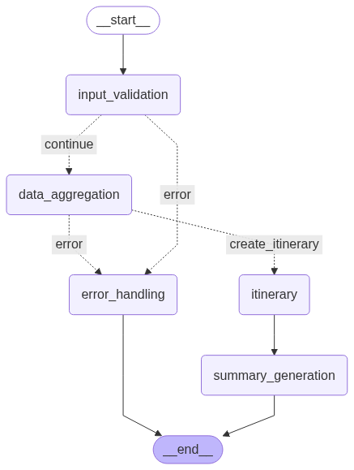

# AI Travel Agent & Expense Planner

A sophisticated multi-agent travel planning system that orchestrates specialized AI agents to create comprehensive trip itineraries with real-time data integration and cost optimization.

## 🌟 Features

### Core Capabilities
- **LangGraph Multi-Agent Architecture**: StateGraph workflow orchestration with specialized agent nodes
- **Natural Language Processing**: Parse travel requests like "Plan a 5-day trip to Tokyo with $2000 budget"
- **Real-time Data Integration**: Weather forecasts, attraction discovery, hotel pricing, currency conversion
- **Cost Optimization**: Budget-aware planning with detailed expense breakdowns
- **Graceful Fallbacks**: System continues working even when external APIs fail
- **Comprehensive Output**: Executive summaries, trip highlights, personalized recommendations

### Travel Planning Features
- **Flexible Duration**: Support for 1-30 day trips
- **Budget Management**: Intelligent cost allocation across categories (accommodation, meals, activities, transport)
- **Weather-Aware Planning**: Activity suggestions based on weather conditions
- **Local Discovery**: Restaurants, attractions, activities, and entertainment venues
- **Multi-Currency Support**: Automatic currency conversion
- **Personalized Recommendations**: Based on budget level, weather, and local options

## 🏗️ System Architecture

### LangGraph Workflow Diagram



### Component Overview

```
┌─────────────────────────────────────────────────────────────┐
│                     Main CLI Interface                      │
│                      (main.py)                             │
└─────────────────────┬───────────────────────────────────────┘
                      │
┌─────────────────────▼───────────────────────────────────────┐
│              LangGraph StateGraph Workflow                  │
│             (LangGraphTravelWorkflow)                       │
│   • Input validation • Parallel execution • State mgmt     │
└─────────────────────┬───────────────────────────────────────┘
                      │
        ┌─────────────┼─────────────┬─────────────┐
        │             │             │             │
┌───────▼──────┐ ┌───▼────┐ ┌──────▼──────┐ ┌───▼────────┐
│ weather_node │ │attr_node│ │ hotels_node │ │ itin_node  │
│• Current     │ │• Places │ │• Pricing    │ │• Day plans │
│• Forecast    │ │• Reviews│ │• Categories │ │• Costs     │
│• Recommend   │ │• Budget │ │• Budget fit │ │• Tools     │
└──────────────┘ └─────────┘ └─────────────┘ └────────────┘
        │             │             │             │
┌───────▼──────┐ ┌───▼────┐ ┌──────▼──────┐ ┌───▼────────┐
│OpenWeatherAPI│ │Foursquare│ │(Fallback   │ │LangGraph   │
│ExchangeRateAPI│ │   API   │ │ Hotels)    │ │ Tools      │
└──────────────┘ └─────────┘ └─────────────┘ └────────────┘
```

### Agent Responsibilities

| Agent | Purpose | Data Sources | Fallback Strategy |
|-------|---------|--------------|-------------------|
| **WeatherAgent** | Climate analysis, travel recommendations | OpenWeatherMap API | Pleasant weather defaults |
| **AttractionAgent** | Discover POIs, restaurants, activities | Foursquare Places API | Curated local suggestions |
| **HotelAgent** | Accommodation options and pricing | Fallback pricing models | Standard rate categories |
| **ItineraryAgent** | Day-by-day planning, cost optimization | All agent outputs | Template-based itineraries |

## 🚀 Quick Start

### Installation

1. **Clone and Navigate**
```bash
cd assignments/assignment-5
```

2. **Set Up Python Environment**
```bash
python -m venv venv
source venv/bin/activate  # On Windows: venv\Scripts\activate
pip install -r requirements.txt
```

3. **Configure API Keys** (Optional - system works with fallbacks)
```bash
# Create .env file with your API keys
cp .env.example .env  # If example exists, or create manually

# Edit .env file:
GEMINI_API_KEY=your_gemini_api_key_here
OPENWEATHER_API_KEY=your_openweather_api_key_here
FOURSQUARE_API_KEY=your_foursquare_api_key_here
EXCHANGERATE_API_KEY=free_api_key  # Works without registration
```

### Basic Usage

**Single Query Mode:**
```bash
python main.py -q "Plan a 5-day trip to Tokyo with $2000 budget"
```

**Interactive Mode:**
```bash
python main.py --interactive
```

**Test Mode:**
```bash
python main.py --test
```

## 📖 Usage Examples

### Example Queries
```bash
# Budget-conscious trip
python main.py -q "Plan a weekend trip to Paris with $800 budget"

# Extended vacation
python main.py -q "2-week vacation in Thailand with $3000"

# City break
python main.py -q "4-day business trip to London"

# Adventure travel
python main.py -q "Visit Iceland for 7 days in winter"
```

### Sample Output
```
============================================================
✅ Status: SUCCESS
🏙️  Destination: Tokyo

📊 Trip Overview:
   📅 Total Days: 5
   💰 Total Cost: USD 2006.38
   📈 Daily Average: USD 401.28

💰 Cost Breakdown:
   Accommodation: USD 1091.38 (54.4%)
   Activities: USD 300.00 (15.0%)
   Meals: USD 365.00 (18.2%)
   Transportation: USD 150.00 (7.5%)
   Miscellaneous: USD 100.00 (5.0%)

⭐ Trip Highlights:
   • Tokyo City Center (Rating: 8.5/10)
   • Walking Tour (Rating: 8.3/10)
   • Traditional Cuisine Experience

📝 Executive Summary:
   A 5-day trip to Tokyo with an estimated total cost of USD 2006.
   Key highlights include top-rated attractions and authentic
   dining experiences. Comprehensive planning from 3 data sources.
============================================================
```

## 🔧 Configuration

### Environment Variables

| Variable | Required | Description | Default |
|----------|----------|-------------|---------|
| `GEMINI_API_KEY` | No* | Google Gemini for LLM operations | fallback_key |
| `OPENWEATHER_API_KEY` | No* | Weather data and forecasts | fallback_key |
| `FOURSQUARE_API_KEY` | No* | Places and reviews | fallback_key |
| `EXCHANGERATE_API_KEY` | No* | Currency conversion | free_api_key |
| `MAX_SEARCH_RESULTS` | No | API result limits | 10 |
| `MAX_RETRIES` | No | API retry attempts | 3 |
| `REQUEST_TIMEOUT` | No | API timeout (seconds) | 30 |

*\*System works with fallback data when APIs are unavailable*

### Getting API Keys

1. **OpenWeatherMap** (Weather data)
   - Visit: https://openweathermap.org/api
   - Sign up for free account
   - Get API key from dashboard
   - Note: May take few hours to activate

2. **Foursquare** (Places data)
   - Visit: https://developer.foursquare.com/
   - Create developer account
   - Generate API key
   - Note: Current version uses legacy endpoints

3. **ExchangeRate-API** (Currency conversion)
   - Visit: https://exchangerate-api.com/
   - Free tier available without registration
   - Optional: Sign up for higher limits

## 📁 Project Structure

```
assignment-5/
├── main.py                          # CLI interface and entry point
├── config.py                        # Configuration management
├── requirements.txt                 # Python dependencies
├── test_connections.py              # API connectivity tests
├── travel_agent_system/             # Main system package
│   ├── __init__.py
│   ├── agents/                      # Specialized AI agents
│   │   ├── __init__.py
│   │   ├── weather_agent.py         # Weather analysis & recommendations
│   │   ├── attraction_agent.py      # POI and restaurant discovery
│   │   ├── hotel_agent.py           # Accommodation search & pricing
│   │   └── itinerary_agent.py       # Trip planning & cost optimization
│   ├── core/                        # Core system components
│   │   ├── __init__.py
│   │   ├── langgraph_workflow.py    # LangGraph StateGraph orchestration
│   │   ├── graph_state.py           # LangGraph state management
│   │   └── nodes.py                 # Workflow node functions
│   ├── tools/                       # Utility tools
│   │   ├── __init__.py
│   │   ├── cost_calculator.py       # Budget calculations
│   │   ├── currency_converter.py    # Multi-currency support
│   │   └── langgraph_tools.py       # LangGraph integrated tools
│   └── utils/                       # Supporting utilities
│       ├── __init__.py
│       ├── api_clients.py           # External API integrations
│       └── formatters.py            # Output formatting
└── tests/                           # Test suite
    ├── __init__.py
    ├── test_agents.py               # Agent unit tests
    ├── test_tools.py                # Tool unit tests
    ├── test_utils.py                # Utility tests
    └── test_workflow.py             # Integration tests
```

## 🧪 Testing

### Run Test Suite
```bash
python -m pytest tests/ -v
```

### Test Individual Components
```bash
# Test API connections
python test_connections.py

# Test specific agent
python -m pytest tests/test_agents.py::TestWeatherAgent -v

# Test with coverage
python -m pytest tests/ --cov=travel_agent_system --cov-report=html
```

### Manual Testing
```bash
# Test mode with sample queries
python main.py --test

# Interactive testing
python main.py --interactive
```

## 🚨 Troubleshooting

### Common Issues

**1. API Key Errors**
```
❌ Weather API call failed: HTTP 401: Invalid API key
```
- **Solution**: Check API key configuration in `.env` file
- **Workaround**: System continues with fallback weather data

**2. Import Errors**
```
❌ Import error: No module named 'travel_agent_system'
```
- **Solution**: Ensure you're in the correct directory and virtual environment is activated
```bash
cd assignments/assignment-5
source venv/bin/activate
pip install -r requirements.txt
```

**3. Foursquare API Errors**
```
❌ HTTP 410: Endpoint no longer supported
```
- **Cause**: Foursquare migrated to new API v3 structure
- **Solution**: System automatically uses fallback attraction data
- **Future Fix**: Update to new Foursquare Places API endpoints

**4. No Results for Destination**
```
❌ Could not extract destination from query
```
- **Solution**: Use clear destination patterns:
  - ✅ "Plan a trip to Tokyo"
  - ✅ "Visit Paris for 3 days"
  - ❌ "I want to go somewhere nice"

### Debug Mode

Enable detailed logging:
```bash
export PYTHONPATH=$PYTHONPATH:$(pwd)
python -c "
import logging
logging.basicConfig(level=logging.DEBUG)
from travel_agent_system.core.workflow import TravelPlannerWorkflow
workflow = TravelPlannerWorkflow()
result = workflow.query('Plan a trip to Tokyo')
print(result)
"
```

## 🔄 System Behavior

### Parallel Processing
- **Weather, Attractions, Hotels** agents run simultaneously
- **Itinerary** agent waits for data from other agents
- **Total Processing Time**: ~1-3 seconds for complete trip plan

### Fallback Strategies
- **API Failures**: Graceful degradation to realistic fallback data
- **Partial Data**: System continues with available information
- **No Internet**: Fully functional offline mode with template data

### Cost Optimization
- **Budget Allocation**: 40-60% accommodation, 20-25% meals, 15-20% activities
- **Budget Warnings**: Alerts when over/under budget
- **Currency Conversion**: Real-time exchange rates when available

## 🚀 Performance Features

- **Concurrent API Calls**: 3-5x faster than sequential processing
- **Smart Caching**: Reduces redundant API calls
- **Timeout Handling**: Never hangs on slow APIs
- **Memory Efficient**: Minimal memory footprint
- **Scalable Architecture**: Easy to add new agents or data sources

## 🔮 Future Enhancements

### Planned Features
- [ ] **Real-time Flight Integration** (Amadeus API)
- [ ] **Calendar Integration** (Google Calendar sync)
- [ ] **Photo Integration** (Unsplash destination photos)
- [ ] **Review Analysis** (Sentiment analysis of reviews)
- [ ] **Travel Document Reminders** (Visa, passport checks)

### API Upgrades
- [ ] **Foursquare Places API v3** migration
- [ ] **Google Places API** integration
- [ ] **Booking.com API** for real hotel prices
- [ ] **Rome2Rio API** for transportation options

## 📄 License

This project is part of an educational assignment. Use for learning purposes.

## 🤝 Contributing

1. Fork the repository
2. Create feature branch (`git checkout -b feature/amazing-feature`)
3. Commit changes (`git commit -m 'Add amazing feature'`)
4. Push to branch (`git push origin feature/amazing-feature`)
5. Open Pull Request

## 📞 Support

For issues and questions:
1. Check the troubleshooting section above
2. Run `python main.py --test` to verify system health
3. Enable debug logging for detailed error information
4. Check API status at respective provider websites

---

**Built with ❤️ using Python, LangGraph, and multiple AI agents working in harmony.** 