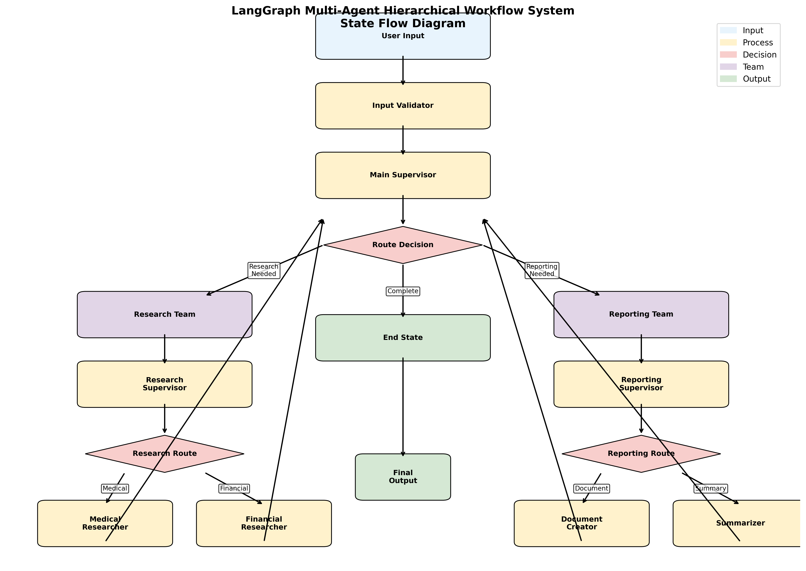

# LangGraph Multi-Agent Hierarchical Workflow System

## State Flow Diagram

*State flow diagram for the hierarchical multi-agent system implementing research and reporting workflows with LangGraph orchestration.*