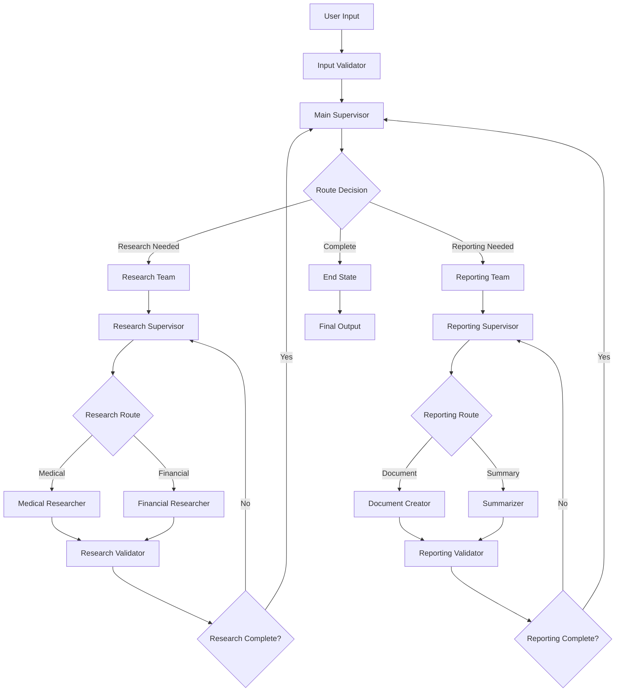

# Technical Architecture Specification

## 📋 Overview

This document provides comprehensive technical specifications for the LangGraph Multi-Agent Hierarchical Workflow System, detailing the architecture, design patterns, data flow, and system components.

## 🏗️ System Architecture

### High-Level Architecture
```
┌─────────────────────────────────────────────────────────────────┐
│                     User Interface Layer                        │
├─────────────────────────────────────────────────────────────────┤
│  CLI Interface  │  Interactive Mode  │  REST API (Future)      │
└─────────────────┴────────────────────┴─────────────────────────┘
                                │
┌─────────────────────────────────────────────────────────────────┐
│                   Orchestration Layer                          │
├─────────────────────────────────────────────────────────────────┤
│              Main Supervisor Agent                             │
│         ┌─────────────────┬─────────────────┐                  │
│         │  Research Team  │  Reporting Team │                  │
│         │   Supervisor    │   Supervisor    │                  │
└─────────┴─────────────────┴─────────────────┴──────────────────┘
                                │
┌─────────────────────────────────────────────────────────────────┐
│                    Agent Execution Layer                       │
├─────────────────────────────────────────────────────────────────┤
│  Medical     │  Financial   │  Document    │  Summary         │
│  Researcher  │  Researcher  │  Creator     │  Agent           │
└──────────────┴──────────────┴──────────────┴──────────────────┘
                                │
┌─────────────────────────────────────────────────────────────────┐
│                     Tool Integration Layer                      │
├─────────────────────────────────────────────────────────────────┤
│  arXiv API   │  OpenAI API  │  Document    │  Error           │
│  Tool        │  Integration │  Generation  │  Handling        │
└──────────────┴──────────────┴──────────────┴──────────────────┘
                                │
┌─────────────────────────────────────────────────────────────────┐
│                    Infrastructure Layer                        │
├─────────────────────────────────────────────────────────────────┤
│  State       │  Configuration│  Logging     │  Monitoring      │
│  Management  │  Management   │  System      │  & Metrics       │
└──────────────┴───────────────┴──────────────┴──────────────────┘
```

### Component Architecture
```
Main Supervisor Agent
├── State Management
│   ├── SupervisorState (TypedDict)
│   ├── State Reducers
│   └── State Validation
├── Routing Logic
│   ├── Team Selection
│   ├── Priority Management
│   └── Error Handling
└── Command Generation
    ├── Handoff Commands
    ├── Error Commands
    └── Completion Commands

Research Team
├── Research Supervisor
├── Medical Researcher
│   ├── arXiv Integration
│   ├── Medical Analysis
│   └── Drug Interaction Analysis
├── Financial Researcher
│   ├── Market Analysis
│   ├── Risk Assessment
│   └── Economic Indicators
└── Research Validation

Reporting Team
├── Reporting Supervisor
├── Document Creator
│   ├── PDF Generation
│   ├── DOCX Generation
│   └── Template Management
├── Summarizer
│   ├── Executive Summary
│   ├── Key Points Extraction
│   └── Quality Assessment
└── Reporting Validation
```

## 🔄 Data Flow Architecture

### State Flow Diagram


### Data Structures

#### Core State Schemas
```python
# SupervisorState
{
    "messages": List[BaseMessage],
    "current_team": Literal["research", "reporting", "end"],
    "research_state": ResearchState,
    "reporting_state": ReportingState,
    "task_description": str,
    "final_output": Dict[str, Any],
    "error_state": Optional[Dict[str, Any]],
    "system_metrics": Dict[str, Any]
}

# ResearchState
{
    "messages": List[BaseMessage],
    "research_topic": str,
    "medical_findings": Dict[str, Any],
    "financial_findings": Dict[str, Any],
    "research_status": Literal["pending", "in_progress", "completed", "failed"],
    "research_metadata": Dict[str, Any]
}

# ReportingState
{
    "messages": List[BaseMessage],
    "research_data": Dict[str, Any],
    "document_path": str,
    "summary": str,
    "report_status": Literal["pending", "in_progress", "completed", "failed"],
    "report_metadata": Dict[str, Any]
}
```

#### Research Data Structure
```python
# Medical Findings
{
    "research_complete": bool,
    "research_topic": str,
    "key_findings": List[str],
    "drug_interactions": {
        "interactions": List[str],
        "contraindications": List[str],
        "safety_considerations": List[str]
    },
    "clinical_insights": {
        "trials": List[Dict],
        "patient_populations": List[str],
        "treatment_protocols": List[str],
        "efficacy_measures": List[str]
    },
    "research_papers": List[Dict],
    "medical_specializations": List[str],
    "quality_indicators": Dict[str, Any],
    "sources": List[str],
    "key_terms": List[str],
    "research_timestamp": str
}

# Financial Findings
{
    "research_complete": bool,
    "research_topic": str,
    "key_findings": List[str],
    "market_analysis": {
        "factors": List[str],
        "trends": List[str],
        "opportunities": List[str],
        "challenges": List[str],
        "sector_impact": Dict[str, str]
    },
    "risk_assessment": {
        "risks": List[str],
        "risk_levels": Dict[str, List[str]],
        "mitigation_strategies": List[str],
        "regulatory_considerations": List[str]
    },
    "economic_indicators": {
        "indicators": List[str],
        "forecasts": List[str],
        "correlations": List[str],
        "leading_indicators": List[str]
    },
    "research_papers": List[Dict],
    "financial_specializations": List[str],
    "quality_indicators": Dict[str, Any],
    "sources": List[str],
    "key_terms": List[str],
    "analysis_timestamp": str
}
```

## 🔧 Design Patterns

### 1. Abstract Factory Pattern
```python
class AgentFactory:
    """Factory for creating specialized agents"""
    
    @staticmethod
    def create_agent(agent_type: str, settings: Settings) -> BaseAgent:
        if agent_type == "medical_researcher":
            return MedicalResearcher(settings)
        elif agent_type == "financial_researcher":
            return FinancialResearcher(settings)
        elif agent_type == "document_creator":
            return DocumentCreator(settings)
        elif agent_type == "summarizer":
            return Summarizer(settings)
        else:
            raise ValueError(f"Unknown agent type: {agent_type}")
```

### 2. Command Pattern
```python
class Command:
    """Command pattern for agent communication"""
    
    def __init__(self, goto: str, update: Dict[str, Any], graph: Optional[str] = None):
        self.goto = goto
        self.update = update
        self.graph = graph
    
    def execute(self, state: Dict[str, Any]) -> Dict[str, Any]:
        """Execute the command on the given state"""
        return {**state, **self.update}
```

### 3. Strategy Pattern
```python
class ResearchStrategy(ABC):
    """Strategy pattern for different research approaches"""
    
    @abstractmethod
    def conduct_research(self, topic: str) -> Dict[str, Any]:
        pass

class MedicalResearchStrategy(ResearchStrategy):
    def conduct_research(self, topic: str) -> Dict[str, Any]:
        # Medical-specific research logic
        pass

class FinancialResearchStrategy(ResearchStrategy):
    def conduct_research(self, topic: str) -> Dict[str, Any]:
        # Financial-specific research logic
        pass
```

### 4. Observer Pattern
```python
class WorkflowObserver(ABC):
    """Observer pattern for workflow monitoring"""
    
    @abstractmethod
    def on_agent_start(self, agent_name: str, state: Dict[str, Any]):
        pass
    
    @abstractmethod
    def on_agent_complete(self, agent_name: str, result: Dict[str, Any]):
        pass
    
    @abstractmethod
    def on_error(self, agent_name: str, error: Exception):
        pass

class MetricsObserver(WorkflowObserver):
    """Concrete observer for collecting metrics"""
    
    def __init__(self):
        self.metrics = defaultdict(list)
    
    def on_agent_start(self, agent_name: str, state: Dict[str, Any]):
        self.metrics[agent_name].append({
            "event": "start",
            "timestamp": datetime.now().isoformat()
        })
```

### 5. Chain of Responsibility Pattern
```python
class ValidationChain:
    """Chain of responsibility for state validation"""
    
    def __init__(self):
        self.validators = []
    
    def add_validator(self, validator: Callable):
        self.validators.append(validator)
    
    def validate(self, state: Dict[str, Any]) -> bool:
        for validator in self.validators:
            if not validator(state):
                return False
        return True
```

## 🚀 Performance Architecture

### Parallel Execution Framework
```python
class ParallelExecutionManager:
    """Manages parallel execution of agents"""
    
    async def execute_parallel(
        self,
        agents: List[BaseAgent],
        state: Dict[str, Any]
    ) -> Dict[str, Any]:
        """Execute multiple agents in parallel"""
        
        # Create tasks for each agent
        tasks = [
            asyncio.create_task(agent.aprocess(state))
            for agent in agents
        ]
        
        # Wait for all to complete
        results = await asyncio.gather(*tasks, return_exceptions=True)
        
        # Combine results
        combined_state = state.copy()
        for result in results:
            if isinstance(result, Exception):
                self.handle_error(result)
            else:
                combined_state.update(result.update)
        
        return combined_state
```

### Caching Strategy
```python
class CacheManager:
    """Manages caching for expensive operations"""
    
    def __init__(self, ttl: int = 3600):
        self.cache = {}
        self.ttl = ttl
    
    def get(self, key: str) -> Optional[Any]:
        """Get cached value if not expired"""
        if key in self.cache:
            value, timestamp = self.cache[key]
            if time.time() - timestamp < self.ttl:
                return value
            else:
                del self.cache[key]
        return None
    
    def set(self, key: str, value: Any):
        """Cache value with timestamp"""
        self.cache[key] = (value, time.time())
```

### Rate Limiting
```python
class RateLimiter:
    """Rate limiting for API calls"""
    
    def __init__(self, max_calls: int, time_window: int):
        self.max_calls = max_calls
        self.time_window = time_window
        self.calls = deque()
    
    async def acquire(self):
        """Acquire permission to make API call"""
        now = time.time()
        
        # Remove old calls outside time window
        while self.calls and self.calls[0] < now - self.time_window:
            self.calls.popleft()
        
        # Check if under limit
        if len(self.calls) >= self.max_calls:
            sleep_time = self.time_window - (now - self.calls[0])
            await asyncio.sleep(sleep_time)
        
        self.calls.append(now)
```

## 🔐 Security Architecture

### API Key Management
```python
class SecureConfigManager:
    """Secure configuration management"""
    
    def __init__(self):
        self.encrypted_keys = {}
        self.cipher = self._init_cipher()
    
    def store_api_key(self, service: str, key: str):
        """Store API key securely"""
        encrypted_key = self.cipher.encrypt(key.encode())
        self.encrypted_keys[service] = encrypted_key
    
    def get_api_key(self, service: str) -> str:
        """Retrieve API key securely"""
        if service in self.encrypted_keys:
            encrypted_key = self.encrypted_keys[service]
            return self.cipher.decrypt(encrypted_key).decode()
        raise KeyError(f"API key for {service} not found")
```

### Input Validation
```python
class InputValidator:
    """Comprehensive input validation"""
    
    @staticmethod
    def validate_research_query(query: str) -> bool:
        """Validate research query"""
        if not query or len(query.strip()) == 0:
            raise ValueError("Query cannot be empty")
        
        if len(query) > 10000:
            raise ValueError("Query too long (max 10000 characters)")
        
        # Check for potentially malicious content
        forbidden_patterns = [
            r'<script.*?>', r'javascript:', r'data:',
            r'eval\(', r'exec\(', r'import\s+os'
        ]
        
        for pattern in forbidden_patterns:
            if re.search(pattern, query, re.IGNORECASE):
                raise ValueError("Query contains forbidden content")
        
        return True
    
    @staticmethod
    def sanitize_filename(filename: str) -> str:
        """Sanitize filename for safe file operations"""
        # Remove/replace dangerous characters
        safe_chars = re.sub(r'[<>:"/\\|?*]', '_', filename)
        
        # Limit length
        if len(safe_chars) > 255:
            safe_chars = safe_chars[:255]
        
        # Ensure not a reserved name
        reserved_names = ['CON', 'PRN', 'AUX', 'NUL'] + [f'COM{i}' for i in range(1, 10)] + [f'LPT{i}' for i in range(1, 10)]
        
        if safe_chars.upper() in reserved_names:
            safe_chars = f"_{safe_chars}"
        
        return safe_chars
```

### Error Handling Security
```python
class SecureErrorHandler:
    """Secure error handling that doesn't leak sensitive information"""
    
    @staticmethod
    def sanitize_error_message(error: Exception, include_details: bool = False) -> str:
        """Sanitize error messages for safe display"""
        
        error_message = str(error)
        
        # Remove sensitive patterns
        sensitive_patterns = [
            r'api[_-]?key[:\s=][^\s]+',
            r'token[:\s=][^\s]+',
            r'password[:\s=][^\s]+',
            r'secret[:\s=][^\s]+',
            r'/home/[^/\s]+',
            r'c:\\users\\[^\\s]+',
            r'[a-zA-Z0-9._%+-]+@[a-zA-Z0-9.-]+\.[a-zA-Z]{2,}'
        ]
        
        for pattern in sensitive_patterns:
            error_message = re.sub(pattern, '[REDACTED]', error_message, flags=re.IGNORECASE)
        
        if not include_details:
            # Return generic error message for production
            error_type = type(error).__name__
            return f"{error_type}: An error occurred during processing"
        
        return error_message
```

## 📊 Monitoring Architecture

### Metrics Collection
```python
class MetricsCollector:
    """Comprehensive metrics collection"""
    
    def __init__(self):
        self.metrics = {
            "agent_performance": defaultdict(list),
            "api_calls": defaultdict(int),
            "error_rates": defaultdict(int),
            "workflow_timing": []
        }
    
    def record_agent_performance(self, agent_name: str, execution_time: float, success: bool):
        """Record agent performance metrics"""
        self.metrics["agent_performance"][agent_name].append({
            "execution_time": execution_time,
            "success": success,
            "timestamp": datetime.now().isoformat()
        })
    
    def record_api_call(self, service: str, success: bool):
        """Record API call metrics"""
        self.metrics["api_calls"][f"{service}_total"] += 1
        if success:
            self.metrics["api_calls"][f"{service}_success"] += 1
        else:
            self.metrics["api_calls"][f"{service}_error"] += 1
    
    def get_summary_metrics(self) -> Dict[str, Any]:
        """Get summary of all metrics"""
        summary = {}
        
        # Agent performance summary
        for agent, performances in self.metrics["agent_performance"].items():
            if performances:
                avg_time = sum(p["execution_time"] for p in performances) / len(performances)
                success_rate = sum(1 for p in performances if p["success"]) / len(performances)
                summary[f"{agent}_avg_time"] = avg_time
                summary[f"{agent}_success_rate"] = success_rate
        
        # API call summary
        for service, count in self.metrics["api_calls"].items():
            summary[f"api_{service}"] = count
        
        return summary
```

### Health Checks
```python
class HealthChecker:
    """System health monitoring"""
    
    def __init__(self, workflow: MultiAgentWorkflow):
        self.workflow = workflow
    
    async def check_system_health(self) -> Dict[str, str]:
        """Comprehensive system health check"""
        health_status = {}
        
        # Check workflow compilation
        try:
            graph = self.workflow.graph
            health_status["workflow_compilation"] = "healthy"
        except Exception as e:
            health_status["workflow_compilation"] = f"unhealthy: {e}"
        
        # Check API connectivity
        try:
            # Simple API test
            model = ChatOpenAI(model="gpt-3.5-turbo", timeout=5)
            response = model.invoke("health check")
            health_status["openai_api"] = "healthy"
        except Exception as e:
            health_status["openai_api"] = f"unhealthy: {e}"
        
        # Check memory usage
        process = psutil.Process(os.getpid())
        memory_mb = process.memory_info().rss / 1024 / 1024
        
        if memory_mb < 500:
            health_status["memory_usage"] = "healthy"
        elif memory_mb < 1000:
            health_status["memory_usage"] = "warning"
        else:
            health_status["memory_usage"] = "critical"
        
        # Check disk space
        disk_usage = psutil.disk_usage('/')
        free_gb = disk_usage.free / (1024**3)
        
        if free_gb > 1:
            health_status["disk_space"] = "healthy"
        elif free_gb > 0.5:
            health_status["disk_space"] = "warning"
        else:
            health_status["disk_space"] = "critical"
        
        return health_status
```

## 🔧 Configuration Architecture

### Hierarchical Configuration
```python
class ConfigurationManager:
    """Hierarchical configuration management"""
    
    def __init__(self):
        self.config_sources = [
            DefaultConfig(),
            EnvironmentConfig(),
            FileConfig(),
            CommandLineConfig()
        ]
    
    def get_configuration(self) -> Settings:
        """Get merged configuration from all sources"""
        config = {}
        
        # Apply configurations in order of precedence
        for source in self.config_sources:
            source_config = source.load()
            config.update(source_config)
        
        return Settings(**config)
    
    def validate_configuration(self, config: Settings) -> List[str]:
        """Validate configuration and return any errors"""
        errors = []
        
        # Required API keys
        if not config.openai_api_key:
            errors.append("OpenAI API key is required")
        
        # Model availability
        valid_models = ["gpt-3.5-turbo", "gpt-4", "gpt-4-turbo"]
        if config.supervisor_model not in valid_models:
            errors.append(f"Invalid supervisor model: {config.supervisor_model}")
        
        # Output directory
        if not os.path.exists(os.path.dirname(config.output_directory)):
            errors.append(f"Output directory parent does not exist: {config.output_directory}")
        
        # Timeout values
        if config.timeout_seconds < 30:
            errors.append("Timeout too low (minimum 30 seconds)")
        
        return errors
```

### Environment-Specific Configurations
```python
class EnvironmentConfig:
    """Environment-specific configuration"""
    
    DEVELOPMENT = {
        "debug_mode": True,
        "log_level": "DEBUG",
        "timeout_seconds": 600,
        "max_retries": 5
    }
    
    PRODUCTION = {
        "debug_mode": False,
        "log_level": "INFO",
        "timeout_seconds": 300,
        "max_retries": 3
    }
    
    TESTING = {
        "debug_mode": True,
        "log_level": "DEBUG",
        "timeout_seconds": 30,
        "max_retries": 1,
        "test_mode": True
    }
    
    @classmethod
    def get_config(cls, environment: str) -> Dict[str, Any]:
        """Get configuration for specified environment"""
        return getattr(cls, environment.upper(), cls.DEVELOPMENT)
```

## 🔄 Deployment Architecture

### Container Architecture
```dockerfile
# Multi-stage build for production deployment
FROM python:3.11-slim as builder

# Install build dependencies
RUN apt-get update && apt-get install -y \
    build-essential \
    && rm -rf /var/lib/apt/lists/*

# Create virtual environment
RUN python -m venv /opt/venv
ENV PATH="/opt/venv/bin:$PATH"

# Install Python dependencies
COPY requirements.txt .
RUN pip install --no-cache-dir -r requirements.txt

# Production stage
FROM python:3.11-slim as production

# Install runtime dependencies
RUN apt-get update && apt-get install -y \
    curl \
    && rm -rf /var/lib/apt/lists/*

# Copy virtual environment from builder
COPY --from=builder /opt/venv /opt/venv
ENV PATH="/opt/venv/bin:$PATH"

# Create application user
RUN useradd --create-home --shell /bin/bash app

# Copy application
COPY --chown=app:app . /app
WORKDIR /app

# Switch to application user
USER app

# Health check
HEALTHCHECK --interval=30s --timeout=10s --start-period=5s --retries=3 \
    CMD python -c "from src.main import MultiAgentWorkflow; print('healthy')"

# Default command
CMD ["python", "-m", "src.cli"]
```

### Kubernetes Deployment
```yaml
# kubernetes/deployment.yaml
apiVersion: apps/v1
kind: Deployment
metadata:
  name: multiagent-research
  labels:
    app: multiagent-research
spec:
  replicas: 3
  selector:
    matchLabels:
      app: multiagent-research
  template:
    metadata:
      labels:
        app: multiagent-research
    spec:
      containers:
      - name: multiagent-research
        image: multiagent-research:latest
        ports:
        - containerPort: 8000
        env:
        - name: OPENAI_API_KEY
          valueFrom:
            secretKeyRef:
              name: api-secrets
              key: openai-api-key
        resources:
          requests:
            memory: "512Mi"
            cpu: "500m"
          limits:
            memory: "1Gi"
            cpu: "1000m"
        livenessProbe:
          httpGet:
            path: /health
            port: 8000
          initialDelaySeconds: 30
          periodSeconds: 10
        readinessProbe:
          httpGet:
            path: /ready
            port: 8000
          initialDelaySeconds: 5
          periodSeconds: 5
```

### Service Mesh Integration
```yaml
# istio/virtual-service.yaml
apiVersion: networking.istio.io/v1beta1
kind: VirtualService
metadata:
  name: multiagent-research
spec:
  hosts:
  - multiagent-research.example.com
  http:
  - match:
    - uri:
        prefix: /api/v1
    route:
    - destination:
        host: multiagent-research
        port:
          number: 8000
    timeout: 300s
    retries:
      attempts: 3
      perTryTimeout: 60s
```

## 📈 Scalability Architecture

### Horizontal Scaling Strategy
```python
class WorkflowScaler:
    """Automatic scaling based on workload"""
    
    def __init__(self, min_instances: int = 1, max_instances: int = 10):
        self.min_instances = min_instances
        self.max_instances = max_instances
        self.current_instances = min_instances
        self.metrics_history = deque(maxlen=100)
    
    def should_scale_up(self, current_load: float) -> bool:
        """Determine if scaling up is needed"""
        if self.current_instances >= self.max_instances:
            return False
        
        # Scale up if average load > 70% for last 5 minutes
        recent_loads = list(self.metrics_history)[-10:]
        if len(recent_loads) >= 5:
            avg_load = sum(recent_loads) / len(recent_loads)
            return avg_load > 0.7
        
        return current_load > 0.8
    
    def should_scale_down(self, current_load: float) -> bool:
        """Determine if scaling down is needed"""
        if self.current_instances <= self.min_instances:
            return False
        
        # Scale down if average load < 30% for last 10 minutes
        recent_loads = list(self.metrics_history)[-20:]
        if len(recent_loads) >= 10:
            avg_load = sum(recent_loads) / len(recent_loads)
            return avg_load < 0.3
        
        return False
```

### Load Balancing
```python
class LoadBalancer:
    """Intelligent load balancing for workflow distribution"""
    
    def __init__(self):
        self.workflow_instances = []
        self.instance_loads = {}
    
    def add_instance(self, instance_id: str, workflow: MultiAgentWorkflow):
        """Add workflow instance to load balancer"""
        self.workflow_instances.append({
            "id": instance_id,
            "workflow": workflow,
            "active_requests": 0,
            "last_used": time.time()
        })
        self.instance_loads[instance_id] = 0
    
    def get_best_instance(self) -> str:
        """Get least loaded instance"""
        if not self.workflow_instances:
            raise RuntimeError("No workflow instances available")
        
        # Find instance with lowest load
        best_instance = min(
            self.workflow_instances,
            key=lambda x: x["active_requests"]
        )
        
        return best_instance["id"]
    
    def update_instance_load(self, instance_id: str, load: float):
        """Update instance load metrics"""
        self.instance_loads[instance_id] = load
        
        # Update active requests count
        for instance in self.workflow_instances:
            if instance["id"] == instance_id:
                instance["last_used"] = time.time()
                break
```

## 🔍 Observability Architecture

### Distributed Tracing
```python
import opentelemetry
from opentelemetry import trace
from opentelemetry.exporter.jaeger.thrift import JaegerExporter
from opentelemetry.sdk.trace import TracerProvider
from opentelemetry.sdk.trace.export import BatchSpanProcessor

class TracingManager:
    """Distributed tracing for workflow observability"""
    
    def __init__(self, service_name: str = "multiagent-research"):
        # Configure tracing
        trace.set_tracer_provider(TracerProvider())
        tracer = trace.get_tracer(__name__)
        
        # Configure Jaeger exporter
        jaeger_exporter = JaegerExporter(
            agent_host_name="jaeger",
            agent_port=6831,
        )
        
        span_processor = BatchSpanProcessor(jaeger_exporter)
        trace.get_tracer_provider().add_span_processor(span_processor)
        
        self.tracer = tracer
    
    def trace_agent_execution(self, agent_name: str):
        """Decorator for tracing agent execution"""
        def decorator(func):
            def wrapper(*args, **kwargs):
                with self.tracer.start_as_current_span(f"agent.{agent_name}") as span:
                    span.set_attribute("agent.name", agent_name)
                    span.set_attribute("agent.type", type(args[0]).__name__)
                    
                    try:
                        result = func(*args, **kwargs)
                        span.set_attribute("agent.success", True)
                        return result
                    except Exception as e:
                        span.set_attribute("agent.success", False)
                        span.set_attribute("agent.error", str(e))
                        raise
            return wrapper
        return decorator
```

### Structured Logging
```python
import structlog

class StructuredLogger:
    """Structured logging for better observability"""
    
    def __init__(self):
        structlog.configure(
            processors=[
                structlog.stdlib.filter_by_level,
                structlog.stdlib.add_logger_name,
                structlog.stdlib.add_log_level,
                structlog.stdlib.PositionalArgumentsFormatter(),
                structlog.processors.TimeStamper(fmt="iso"),
                structlog.processors.StackInfoRenderer(),
                structlog.processors.format_exc_info,
                structlog.processors.UnicodeDecoder(),
                structlog.processors.JSONRenderer()
            ],
            context_class=dict,
            logger_factory=structlog.stdlib.LoggerFactory(),
            wrapper_class=structlog.stdlib.BoundLogger,
            cache_logger_on_first_use=True,
        )
        
        self.logger = structlog.get_logger()
    
    def log_workflow_start(self, workflow_id: str, query: str):
        """Log workflow start"""
        self.logger.info(
            "workflow_started",
            workflow_id=workflow_id,
            query=query[:100],  # Truncate for logs
            event_type="workflow_lifecycle"
        )
    
    def log_agent_performance(self, agent_name: str, execution_time: float, success: bool):
        """Log agent performance"""
        self.logger.info(
            "agent_completed",
            agent_name=agent_name,
            execution_time=execution_time,
            success=success,
            event_type="agent_performance"
        )
```

---

*This technical architecture specification provides the comprehensive foundation for building, deploying, and maintaining the LangGraph Multi-Agent Hierarchical Workflow System with professional standards for scalability, security, and observability.*